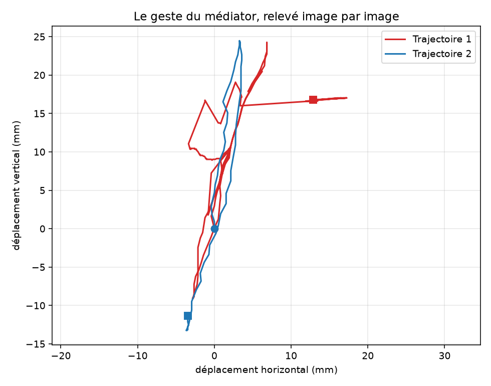
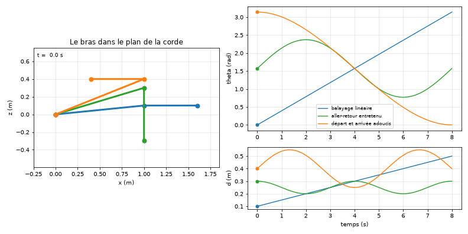
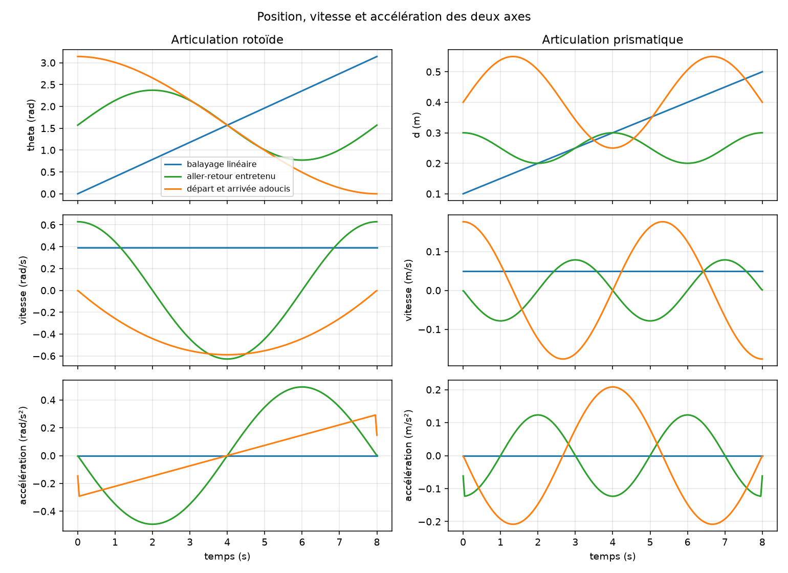

# Robot guitariste

[](https://github.com/rivaldopiaplle-boop/git_robot-guitariste/actions/workflows/ci.yml)

Portfolio : https://git-portfolio-rivaldo.vercel.app/projets/robot-guitariste

Projet pluridisciplinaire d'équipe (ENIB, 4ᵉ année) : un robot qui se place sur les frettes d'une guitare et attaque la corde en rythme.

**Ma part** : modélisation des mécanismes et des chaînes cinématiques, outils de simulation en Python (trajectoires, vitesses, accélérations), analyse et optimisation des configurations, intégration mécanique / électronique / logiciel, documentation technique.

## Ce que contient le dossier

```
robot-guitariste/
├── firmware/
│   ├── control_guitarra/          micrologiciel STM32F411 (STM32CubeIDE), version de référence
│   └── versions-precedentes/      control_guitarra1, control_guitarra2
├── simulation/
│   ├── animation_cinematique.py   la cinématique du bras : modèle, trajectoires, animation
│   ├── produire-figures.py        rejoue la simulation et écrit les images, sans fenêtre
│   ├── sorties/                   les images produites, celles que montre le portfolio
│   └── essais/                    les scripts d'essai successifs, gardés pour mémoire
├── analyse-geste/
│   ├── analyser-kinovea.py        relit le relevé Kinovea et en tire les chiffres
│   └── sorties/                   le geste mesuré, sa vitesse, et mesures.json
├── cao-solidworks/                pièces, assemblages et animations SolidWorks
│   └── rendus/                    les animations converties, lisibles partout
├── documents/                     rapport signé, comptes rendus, planification, relevé Kinovea
│                                  (le logiciel Kinovea lui-même reste hors du dépôt)
└── archives/                      export d'origine du projet
```

## Le geste humain, mesuré avant d'être imité



On ne dimensionne pas un robot guitariste sur une intuition. Le geste a d'abord été filmé
au ralenti, à cinquante images par seconde, puis suivi point par point dans Kinovea avec un
étalonnage pris sur l'écart entre deux cordes, onze millimètres. `analyse-geste/` relit ce
relevé et en tire les chiffres qui contraignent le mécanisme :

| Mesure | Valeur |
|---|---|
| Points suivis | 272 sur 5.42 s |
| Amplitude du balayage | 33.3 mm, soit environ trois cordes |
| Chemin parcouru par le médiator | 185.7 mm |
| Vitesse maximale | 465 mm/s |
| Vitesse moyenne | 34 mm/s |

C'est la cible. Les courbes de la simulation, plus bas, disent ce que le mécanisme sait
faire ; l'écart entre les deux est ce qui a guidé les choix de conception.

```bash
cd analyse-geste && python analyser-kinovea.py
```

## La simulation cinématique



Le mécanisme compte deux axes : une articulation prismatique qui porte le bras le long de
la corde, et une articulation rotoïde qui présente l'outil sur la frette. La position de
l'outil se calcule directement, `x = A + B cos(theta)` et `z = d - B sin(theta)`, ce qui
permet d'éprouver un mouvement avant de l'usiner.

Trois mouvements sont éprouvés : un balayage linéaire, un aller-retour entretenu, et un
déplacement adouci au départ et à l'arrivée. Les courbes de vitesse et d'accélération
disent lequel le mécanisme peut suivre :

| Mouvement | Vitesse maximale | Accélération maximale |
|---|---|---|
| Balayage linéaire | 0,39 rad/s | 0 rad/s² (vitesse constante) |
| Aller-retour entretenu | 0,63 rad/s | 0,49 rad/s² |
| Départ et arrivée adoucis | 0,59 rad/s | 0,29 rad/s² |

Le troisième est le bon compromis : presque aussi rapide que l'aller-retour entretenu, avec
une accélération réduite de moitié, donc moins d'effort demandé au moteur et moins de
vibration transmise au manche.



## Reprendre le projet

| Partie | Outil | Démarrer |
|---|---|---|
| Micrologiciel | STM32CubeIDE, carte Nucleo STM32F411 | *File → Import → Existing Projects* → `firmware/control_guitarra`, puis *Build* et *Debug* |
| Interface de pilotage | Python 3 + `pyserial` | `python firmware/control_guitarra/hmi_guitarra.py` (port série de la carte) |
| Simulation | Python 3 + `numpy`, `matplotlib`, `pillow` | `cd simulation && python produire-figures.py` |
| Mécanique | SolidWorks | ouvrir `cao-solidworks/Assemblage1.SLDASM` |

Les vidéos (`documents/*.mp4`) restent sur la machine : elles dépassent la taille acceptée par GitHub.

## État

Terminé dans le cadre du projet d'école. Présenté dans le portfolio (fiche « Robot guitariste »).

## À améliorer

- [ ] Nettoyer `firmware/` : ne garder qu'une version, documenter les commandes série (codes `X1…X12`, états `EN`, `N`, `G`…)
- [ ] `requirements.txt` pour la simulation et l'interface
- [ ] Une vidéo courte du robot qui joue, hébergée hors du dépôt
- [ ] Schéma du câblage (moteur pas-à-pas, solénoïde, alimentation)
